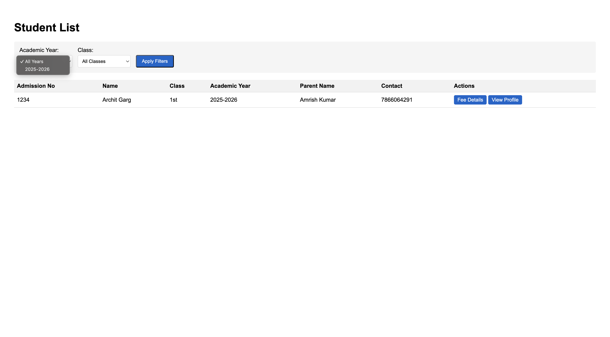
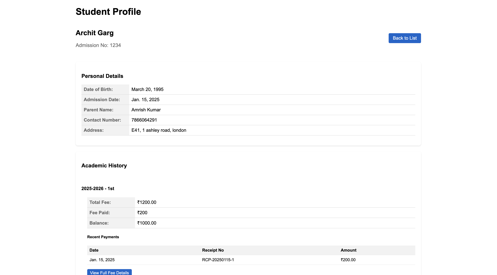
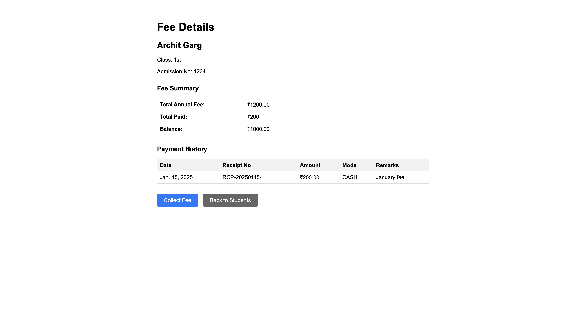
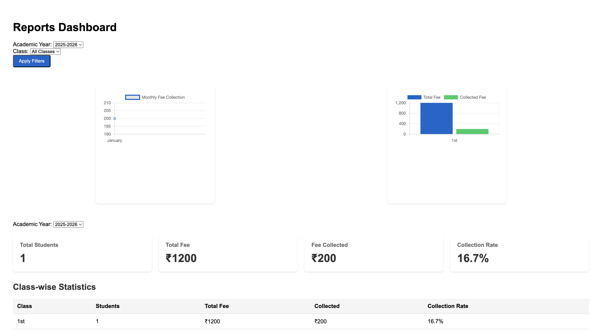

# School Management System

A Django-based school management system for educational institutions to manage students and fee collection.

## Features

### Student Management
- Admission, profiles, year/class-wise listing



### Fee Management
- Collection, payment history, defaulter tracking



### Reports & Analytics
- Collection statistics with visual charts


## Tech Stack

- Python 3.8+
- Django 4.2
- SQLite
- Chart.js

## Setup

1. Clone repository and create virtual environment
```
git clone https://github.com/YOUR_USERNAME/school-management-system.git
cd school-management-system
python -m venv venv
source venv/bin/activate
```

2. Install dependencies and run
```
pip install -r requirements.txt
python manage.py migrate
python manage.py createsuperuser
python manage.py runserver
```

3. Access application
- Admin: http://127.0.0.1:8000/admin/
- Main App: http://127.0.0.1:8000/

## Initial Setup Required via admin view
1. Create Academic Years in admin
2. Set up Grades/Classes with fees
3. Create user accounts

## License
MIT License
